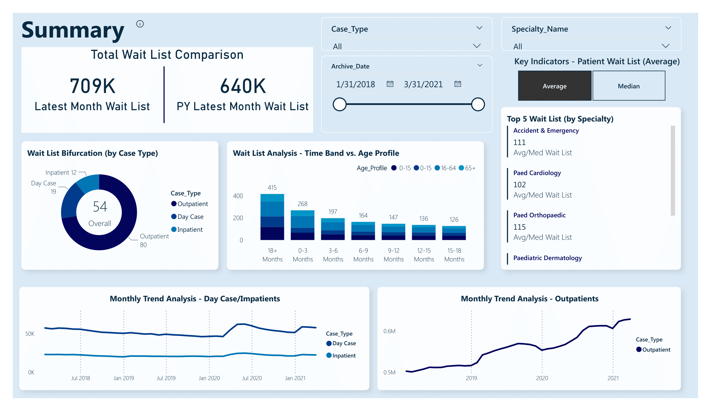
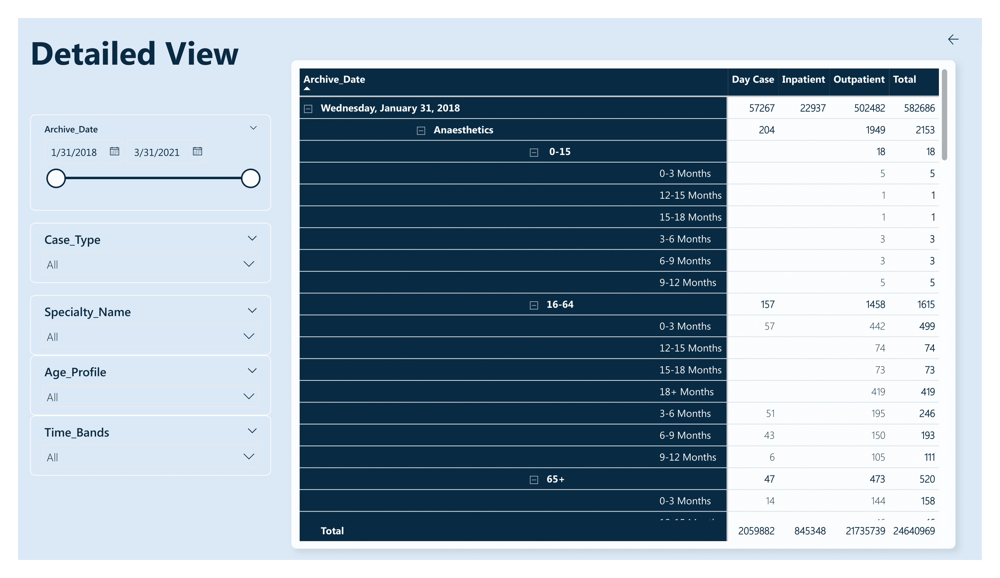
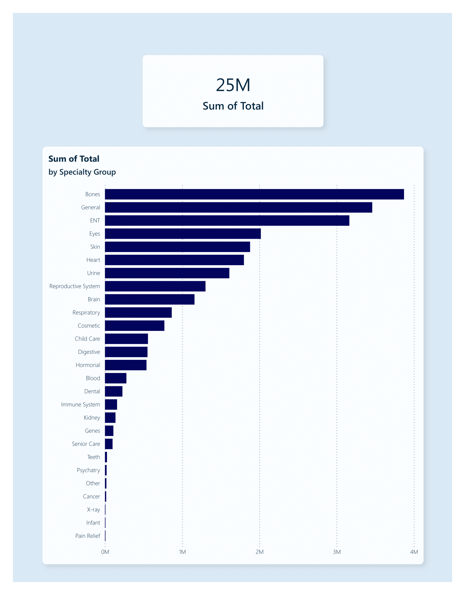

# Healthcare Analytics Dashboard 🏥

## Overview

The **Healthcare Analytics Dashboard** is an interactive Power BI project designed to provide actionable insights into hospital operations. It focuses on analyzing **inpatient** and **outpatient** data over a span of four years (2018-2021), combined with specialty mapping to track resource utilization and patient trends.

---

## Dashboard Features

### Summary Dashboard
- High-level KPIs, such as **average wait time**, **service utilization**, and **patient counts**.
- Comparison of trends across inpatient and outpatient services.

### Detailed View
- Breakdowns by **year**, **specialty**, and **patient demographics**.
- Interactive visualizations with dynamic filtering for deeper insights.

### Drilldown Tab
- Granular insights into individual services or timeframes.
- Enables users to drill through KPIs to view raw data trends.

---

## Repository Contents

| File/Folder Name            | Description                                                                 |
|-----------------------------|-----------------------------------------------------------------------------|
| `data/`                     | Contains inpatient, outpatient, and specialty mapping data.                |
| `visualizations/`           | Screenshots of the dashboard’s key views.                                  |
| `pbix/`                     | Power BI file for the Healthcare Analytics Dashboard.                      |
| `README.md`                 | Project overview and instructions.                                         |
| `LICENSE`                   | License for the project.                                                   |

### Data Structure

#### **`data/inpatients/`**
- Contains inpatient data for each year:
  - `2018.csv`: Inpatient records for 2018.
  - `2019.csv`: Inpatient records for 2019.
  - `2020.csv`: Inpatient records for 2020.
  - `2021.csv`: Inpatient records for 2021.

#### **`data/outpatients/`**
- Contains outpatient data for each year:
  - `2018.csv`: Outpatient records for 2018.
  - `2019.csv`: Outpatient records for 2019.
  - `2020.csv`: Outpatient records for 2020.
  - `2021.csv`: Outpatient records for 2021.

#### **`data/mapping-specialty.csv`**
- Maps patient specialties to associated departments, facilitating analysis of trends by specialty.

---

## Screenshots

### **1. Summary Dashboard**


### **2. Detailed View**


### **3. Drilldown Tab**


---

## Key Metrics and DAX Formulas

### 1. Total Patients
```dax
Total Patients = COUNT(Patients[PatientID])
```

### 2. Average Wait Time
```dax
Avg Wait Time = AVERAGE(Appointments[Wait Time (Days)])
```

### 3. Specialty Utilization
```dax
Specialty Utilization = 
CALCULATE(
    COUNT(Appointments[Specialty]),
    FILTER(Appointments, Appointments[Completed] = TRUE)
)
```

---

## How to Use This Repository

1. **Clone the Repository**:
   ```bash
   git clone https://github.com/Sohila-Khaled-Abbas/healthcare-analytics-dashboard.git
   ```

2. **Open the Power BI Dashboard**:
   - Download the `Healthcare_Analytics_Dashboard.pbix` file from the `pbix/` folder.
   - Open it using Power BI Desktop to explore or modify the dashboard.

3. **Load the Data**:
   - Import the inpatient, outpatient, and specialty mapping data from the `data/` folder into Power BI.

4. **Explore Visualizations**:
   - Screenshots of the dashboard are available in the `visualizations/` folder.

---

## Future Improvements

- **Integrate Real-Time Data**:
  - Enable live database connections for real-time analytics.

- **Predictive Analytics**:
  - Implement machine learning models to forecast patient demand and wait times.

- **Enhanced Visualization**:
  - Add additional drill-through pages for specific specialties or time periods.

---

## License

This project is licensed under the MIT License. See the [LICENSE](LICENSE) file for details.

---

## About Me

👋 I’m **Sohila Khaled Galal Abbas**, a passionate data analyst specializing in **Power BI** and **SQL**.  
Let’s connect:  
- **LinkedIn**: [linkedin.com/in/sohilakhaledabbas](https://www.linkedin.com/in/sohilakhaledabbas)  
- **GitHub**: [github.com/Sohila-Khaled-Abbas](https://github.com/Sohila-Khaled-Abbas)

